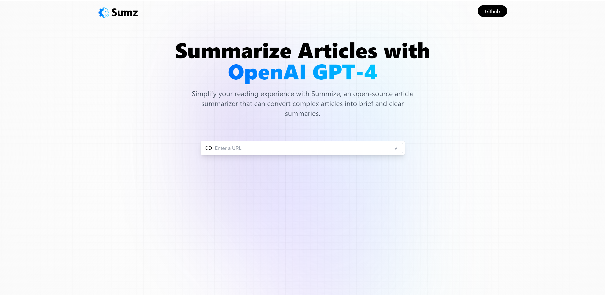
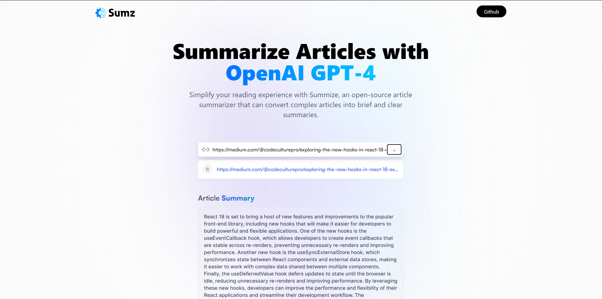

# Article Summarizer

A web application that summarizes articles and blog posts using RapidAPI's Article Extractor and Summarizer API. Built using React, Redux, Tailwind CSS, and Vite.

This is a article summarize website using Article Extractor and Summarizer API (https://rapidapi.com/restyler/api/article-extractor-and-summarizer). And this project is created by watching the tutorials of Javascript Mastery (https://www.jsmastery.pro/)

## Demo

url here

## Features

- Enter a URL of an article or blog post to generate a summary
- Localstorage for storing recent search URLs
- Clean, responsive UI with Tailwind CSS
- Deployed on Netlify

### Screenshot

###

###

###

## Acknowledgements

- [RapidAPI](https://rapidapi.com/hub/)
- [Article-extractor-and-summarizer API](https://rapidapi.com/restyler/api/article-extractor-and-summarizer)
- [Tailwind CSS](https://tailwindcss.com/)
- [React](https://react.dev/)
- [Vite](https://vitejs.dev/)
- [Netlify](https://www.netlify.com/)
- [Javascript Mastery](https://www.jsmastery.pro/)